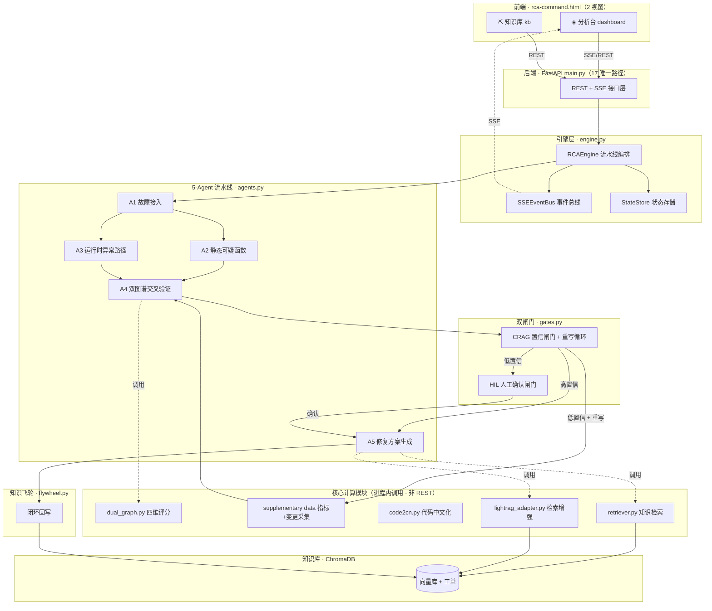
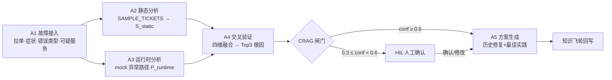
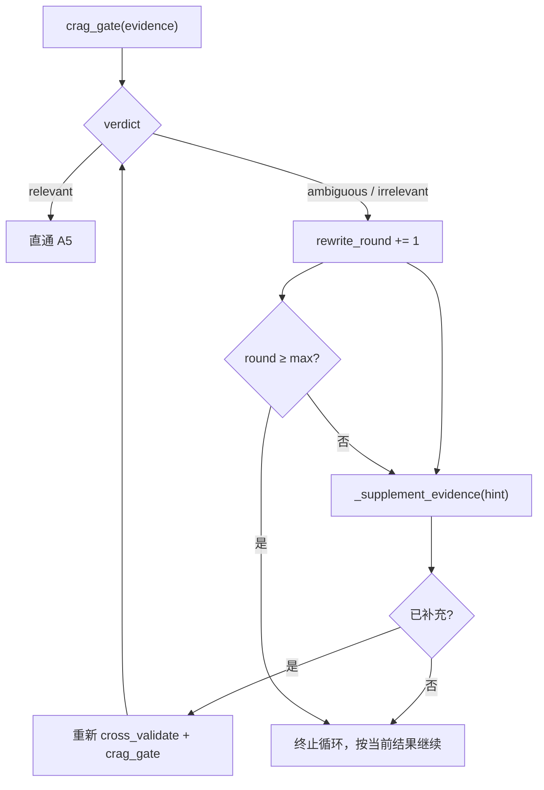
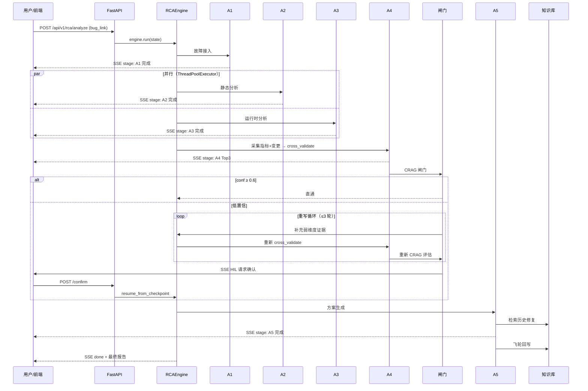
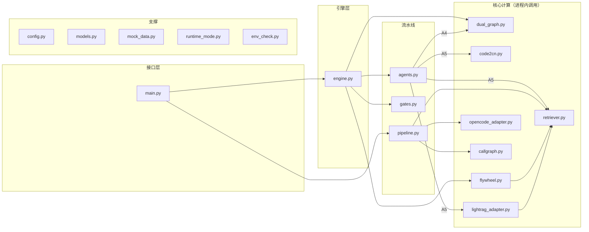

# RCA 智能根因分析系统 · 架构文档

> 版本：v4.0（E1-E4 长期演进完成）　|　更新日期：2026-09-19
> 本文档描述系统当前架构与核心能力，作为后续开发与运维的权威参考。

---

## 1. 概述

RCA 系统是一个基于 **5-Agent 流水线**的智能根因分析平台，核心使命是：**给定一个故障单（Bug Link / 描述），自动定位根因函数并给出修复建议**。

系统聚焦两大核心能力：

- **根因分析**：`A1 → A2‖A3 → A4 交叉验证 → 双闸门 → A5 方案生成` 的智能流水线
- **知识库**：基于 ChromaDB 向量库的工单导入、检索、删除全生命周期管理

5-Agent 编排由 [engine.py](file:///workspace/rca-backend/app/engine.py) 的 `RCAEngine` 统一调度，4 个 Agent 定义于 [agents.py](file:///workspace/rca-backend/app/agents.py)，A4 交叉验证由 [dual_graph.py](file:///workspace/rca-backend/app/dual_graph.py) 的 `cross_validate` 直接承担。

---

## 2. 系统整体架构



---

## 3. 根因分析引擎（5-Agent 流水线）

流水线由 [engine.py](file:///workspace/rca-backend/app/engine.py) 的 `RCAEngine.run()` 编排：



| 阶段 | 实现 | 职责 | 输入 → 输出 |
|------|------|------|------------|
| A1 | [AgentA1](file:///workspace/rca-backend/app/agents.py#L24) | 故障接入：拉取工单、提取症状、推断错误类型、构建查询、定位可疑服务 | BugInfo → A1Output |
| A2 | [AgentA2](file:///workspace/rca-backend/app/agents.py#L116) | 静态分析：基于 `SAMPLE_TICKETS` 生成静态可疑函数集（mock_demo 模式） | suspect_services → S_static |
| A3 | [AgentA3](file:///workspace/rca-backend/app/agents.py#L142) | 运行时分析：mock_demo 模式返回硬编码异常传播路径 | suspect_services → AnomalyPath |
| A4 | [engine._apply_a4](file:///workspace/rca-backend/app/engine.py#L236) + [dual_graph.cross_validate](file:///workspace/rca-backend/app/dual_graph.py#L70) | 双图谱交叉验证：四维加权融合静态与运行时，输出 Top3 根因 | S_static + P_runtime + 指标 + 变更 → Top3 |
| A5 | [AgentA5](file:///workspace/rca-backend/app/agents.py#L170) | 修复方案生成：检索历史修复 + 最佳实践，组装解决方案 | Top3 → Solution |

**编排特性**：A2 与 A3 **并行执行**（无数据依赖），A4 汇聚两者结果，形成 `A1 → A2‖A3 → A4 → 闸门 → A5` 的拓扑。

### 3.1 并行执行（ThreadPoolExecutor）

A2/A3 并行 fan-out 由 [engine.py:_apply_a2a3_parallel](file:///workspace/rca-backend/app/engine.py#L216) 实现，采用 `concurrent.futures.ThreadPoolExecutor`：

```python
with ThreadPoolExecutor(max_workers=2) as pool:
    future_a2 = pool.submit(self.a2.run, state.suspect_services, state.bug_info.stack)
    future_a3 = pool.submit(self.a3.run, state.suspect_services)
    state.S_static = future_a2.result()
    state.P_runtime = future_a3.result()
```

`max_workers=2`，上下文管理器自动回收线程池，`future.result()` 自动传播子线程异常。

### 3.2 四维融合评分（dual_graph.py）

[dual_graph.py](file:///workspace/rca-backend/app/dual_graph.py) 是 A4 的核心算法，`compute_score` 对每个候选函数计算四维加权分：

| 权重 | 维度 | 含义 | 数据来源 | 默认值 |
|------|------|------|---------|--------|
| `w1` | `static_depth` | 静态调用可达深度 | A2 的 `SuspectFunction.static_depth` | 0.3 |
| `w2` | `runtime_anomaly` | 运行时异常度 | A3 的 `AnomalyPath.runtime_anomaly` | 0.3 |
| `w3` | `metric_corr` | 指标相关性 | `MetricAnomalies.functions[func_id]` | 0.2 |
| `w4` | `change_recency` | 变更近因 | `ChangeRecords`（7 日内归一化） | 0.2 |

评分公式（[dual_graph.py:53](file:///workspace/rca-backend/app/dual_graph.py#L53)）：

```
score = w1·static_depth + w2·runtime_anomaly + w3·metric_corr + w4·change_recency
```

`cross_validate` 对静态可达函数集与运行时异常路径取交集，按 score 降序输出最多 3 个 `Candidate`。权重配置见 [config.py:ScoreWeights](file:///workspace/rca-backend/app/config.py#L43)。

### 3.3 指标 + 变更数据采集（E2 演进）

[engine.py:_collect_supplementary_data](file:///workspace/rca-backend/app/engine.py#L360) 在 A2A3 完成后采集 `metric_anomalies` 与 `change_records`，供 A4 的 w3/w4 维度使用：

| 模式 | 采集行为 |
|------|---------|
| `mock_demo` | 基于 `P_runtime.functions` 生成兜底指标 + 变更数据（`_generate_fallback_metrics` / `_generate_fallback_changes`） |
| `online_full` / `offline_light` | 暂无监控/CI 集成，返回 `None`（降级，w3/w4 记 0） |

采集结果写入 [RCAState.metric_anomalies](file:///workspace/rca-backend/app/models.py#L352) 与 [RCAState.change_records](file:///workspace/rca-backend/app/models.py#L353)，由 `_apply_a4` 传入 `cross_validate`。

---

## 4. 双闸门机制

定义于 [gates.py](file:///workspace/rca-backend/app/gates.py)，阈值配置于 [config.py:GateConfig](file:///workspace/rca-backend/app/config.py#L63)：

| 闸门 | 函数 | 阈值 | 作用 |
|------|------|------|------|
| CRAG | [crag_gate](file:///workspace/rca-backend/app/gates.py#L12) | `GATE_CONFIDENCE_THRESHOLD = 0.6` | 置信度分级：≥0.6 直通；≥0.3×阈值 触发重写；更低降级 |
| HIL | `hil_gate` | `HIL_CONFIDENCE_THRESHOLD = 0.7` | 低置信触发人工确认，支持 `resume` 恢复 |

### 4.1 CRAG 评估 → 重写循环（E3 演进）

[engine.py:_apply_gates](file:///workspace/rca-backend/app/engine.py#L255) 实现评估→重写循环，上限由 `config.gate.max_rewrite_rounds`（默认 3）控制：



`crag_gate` 在每个判定分支产出重写信号，驱动 `_supplement_evidence` 的补充策略：

| 判定 | 触发条件 | `rewritten_query` | 补充策略 |
|------|---------|------------------|---------|
| `relevant` | `avg_confidence ≥ 0.6` | `None` | 无需补充，直通 |
| `ambiguous` | `0.6 × 0.5 ≤ avg < 0.6` | 弱维度组合，如 `"metric_corr,change_recency"` | 按弱维度补充对应数据 |
| `irrelevant` | `avg < 0.3` 或证据为空 | `"broaden"` | 全维度补充 |

`_supplement_evidence` 根据 hint 识别需补充的维度（`metric_corr` / `change_recency` / `broaden`），调用兜底生成器补充缺失数据后重新 `cross_validate` 与 `crag_gate`，直至 verdict 为 relevant 或达到轮次上限。

### 4.2 HIL 人工确认

低置信触发 HIL 后，流水线在检查点挂起。人工确认后通过 [engine.py:resume_from_checkpoint](file:///workspace/rca-backend/app/engine.py#L346) 恢复执行，无需重跑 A1–A4。

---

## 5. 知识库与飞轮

### 5.1 知识库管理

基于 ChromaDB 向量库（[retriever.py](file:///workspace/rca-backend/app/retriever.py)），提供工单导入、检索、删除全生命周期管理，是 A5 历史修复检索与飞轮回写的数据底座。

### 5.2 知识飞轮

定义于 [flywheel.py](file:///workspace/rca-backend/app/flywheel.py)（`Flywheel` 类）：A5 产出的修复方案经去重（cosine ≥ `GATE_DEDUP_COSINE_THRESHOLD`，默认 0.95 视为重复）后**闭环回写知识库**，形成「分析 → 修复 → 沉淀 → 再分析」的飞轮。

---

## 6. 可观测性（E1 演进）

全链路采用结构化日志，消除静默异常吞噬。所有 `except` 分支均带上下文 `logger.warning`：

| 文件 | 覆盖场景 |
|------|---------|
| [engine.py](file:///workspace/rca-backend/app/engine.py) | 流水线异常、CRAG 重写轮次、补充数据采集 |
| [flywheel.py](file:///workspace/rca-backend/app/flywheel.py) | 回写同步失败 |
| [lightrag_adapter.py](file:///workspace/rca-backend/app/lightrag_adapter.py) | `ainsert` / `ainsert_custom_kg` / `aquery` 失败 |
| [main.py](file:///workspace/rca-backend/app/main.py) | API 层异常 |

---

## 7. 实时通信与状态

- **SSE 流式推送**：[SSEEventBus](file:///workspace/rca-backend/app/engine.py#L33) 在每个 Agent 阶段实时推送进度，Redis list 持久化 + 内存回退，前端分析台订阅展示
- **状态持久化**：[StateStore](file:///workspace/rca-backend/app/engine.py#L73) 保存 [RCAState](file:///workspace/rca-backend/app/models.py#L344)，支持 HIL 检查点恢复

[RCAState](file:///workspace/rca-backend/app/models.py#L344) 携带 16 个字段，关键流转字段：

| 字段 | 类型 | 说明 |
|------|------|------|
| `S_static` | `list[SuspectFunction]` | A2 静态可疑函数集 |
| `P_runtime` | `AnomalyPath` | A3 运行时异常路径 |
| `metric_anomalies` | `Optional[MetricAnomalies]` | E2 指标异常（w3 维度数据源） |
| `change_records` | `Optional[ChangeRecords]` | E2 变更记录（w4 维度数据源） |
| `top3` | `list[RootCause]` | A4 输出的 Top3 根因 |
| `gate_status` | `GateStatus` | 闸门状态（crag / hil） |
| `runtime_mode` | `Literal[...]` | 运行模式：`online_full` / `offline_light` / `mock_demo` |

---

## 8. 数据流时序



---

## 9. API 接口清单（17 唯一路径）

| 路径 | 方法 | 功能 | 类别 |
|------|------|------|------|
| `/api/health` | GET | 基础健康检查 | 健康 |
| `/api/v1/health` | GET | V3 组件级健康检查 | 健康 |
| `/api/analyze` | POST | V2 分析触发（兼容） | 根因分析 |
| `/api/analyze/{task_id}/stream` | GET | V2 SSE 流 | 根因分析 |
| `/api/analyze/{task_id}` | GET | V2 报告查询 | 根因分析 |
| `/api/v1/rca/analyze` | POST | V3 分析触发 | 根因分析 |
| `/api/v1/rca/tasks` | GET | 任务列表 | 根因分析 |
| `/api/v1/rca/{task_id}/stream` | GET | V3 SSE 流 | 根因分析 |
| `/api/v1/rca/{task_id}` | GET | V3 结果查询 | 根因分析 |
| `/api/v1/rca/{task_id}/state` | GET | 状态查询 | 根因分析 |
| `/api/v1/rca/{task_id}/confirm` | POST | HIL 人工确认 | 根因分析 |
| `/api/v1/rca/{task_id}/resume` | POST | HIL 恢复执行 | 根因分析 |
| `/api/kb/import` | POST | 知识库导入 | 知识库 |
| `/api/kb/count` | GET | 知识库计数 | 知识库 |
| `/api/kb/tickets` | GET | 工单列表 | 知识库 |
| `/api/kb/tickets` | DELETE | 工单删除 | 知识库 |
| `/api/v1/yunjie/import` | POST | 云捷工单导入 | 知识库 |

> `/api/kb/tickets` 同一路径注册 GET 与 DELETE 两个方法，故路由装饰器共 18 个、唯一路径 17 个。

---

## 10. 模块依赖关系



**核心调用链**：A2/A3 并行产出 → A4 经 `cross_validate` 四维融合 → CRAG 评估→重写循环 → A5 经 retriever / lightrag_adapter 检索 → flywheel 回写。

---

## 11. 目录结构

```
/workspace
├── rca-command.html              # 前端（2 视图：分析台 + 知识库）
├── rca-solution-summary.html     # 方案文档
├── ARCHITECTURE.md              # 本架构文档
└── rca-backend/
    ├── app/                      # 18 个 Python 模块
    │   ├── main.py              # FastAPI（17 唯一路径）
    │   ├── engine.py            # RCAEngine + SSEEventBus + StateStore
    │   ├── agents.py            # A1/A2/A3/A5 四个 Agent（A4 由 engine 直接调用 dual_graph）
    │   ├── pipeline.py          # V2 Pipeline（6 步：拉单→克隆→分析→调用图→检索→综合）
    │   ├── gates.py             # CRAG + HIL 双闸门（含重写信号）
    │   ├── dual_graph.py        # 四维融合评分 + cross_validate
    │   ├── code2cn.py           # 代码中文化（A5 进程内调用）
    │   ├── lightrag_adapter.py  # RAG 检索（A5 进程内调用）
    │   ├── retriever.py         # 知识检索（ChromaDB）
    │   ├── flywheel.py          # 知识飞轮
    │   ├── opencode_adapter.py  # OpenCode 代码分析适配器
    │   ├── callgraph.py         # 调用图辅助
    │   ├── runtime_mode.py      # 降级模式矩阵
    │   ├── models.py            # 数据模型（RCAState 16 字段）
    │   ├── config.py            # 配置（GateConfig + ScoreWeights）
    │   ├── mock_data.py         # Mock 样本数据
    │   ├── env_check.py         # 环境检查
    │   └── __init__.py          # 包初始化
    └── tests/                   # 198 测试用例（12 测试文件）
```

---

## 12. 测试体系

全量回归：**198 passed, 0 failed**（0 RuntimeWarning，3 个第三方 chromadb DeprecationWarning）。

| 测试文件 | 用例数 | 覆盖范围 |
|---------|--------|---------|
| [test_e2e_full.py](file:///workspace/rca-backend/tests/test_e2e_full.py) | 28 | V2/V3 全端点端到端 |
| [test_engine.py](file:///workspace/rca-backend/tests/test_engine.py) | 26 | RCAEngine 流水线 |
| [test_gates_flywheel.py](file:///workspace/rca-backend/tests/test_gates_flywheel.py) | 25 | 双闸门 + 飞轮 |
| [test_dual_graph.py](file:///workspace/rca-backend/tests/test_dual_graph.py) | 24 | 四维评分 + 交叉验证 |
| [test_lightrag_api.py](file:///workspace/rca-backend/tests/test_lightrag_api.py) | 18 | RAG 适配器 |
| [test_deploy.py](file:///workspace/rca-backend/tests/test_deploy.py) | 18 | 部署验证 |
| [test_degradation.py](file:///workspace/rca-backend/tests/test_degradation.py) | 12 | 降级模式 |
| [test_integration.py](file:///workspace/rca-backend/tests/test_integration.py) | 11 | 集成测试 |
| [test_code2cn.py](file:///workspace/rca-backend/tests/test_code2cn.py) | 11 | 代码中文化 |
| [test_pipeline_synthesize.py](file:///workspace/rca-backend/tests/test_pipeline_synthesize.py) | 10 | V2 Pipeline 综合 |
| [test_env_validation.py](file:///workspace/rca-backend/tests/test_env_validation.py) | 8 | 环境校验 |
| [test_e2e.py](file:///workspace/rca-backend/tests/test_e2e.py) | 7 | E2E 冒烟 |

---

## 13. 配置参数

### 13.1 GateConfig（[config.py:63](file:///workspace/rca-backend/app/config.py#L63)）

| 字段 | 默认值 | 环境变量 | 说明 |
|------|--------|---------|------|
| `confidence_threshold` | 0.6 | `GATE_CONFIDENCE_THRESHOLD` | CRAG 直通阈值 |
| `hil_confidence_threshold` | 0.7 | `HIL_CONFIDENCE_THRESHOLD` | HIL 触发阈值 |
| `max_rewrite_rounds` | 3 | `GATE_MAX_REWRITE_ROUNDS` | CRAG 重写循环上限 |
| `max_supplement_rounds` | 2 | `GATE_MAX_SUPPLEMENT_ROUNDS` | 补充轮次上限 |
| `dedup_cosine_threshold` | 0.95 | `GATE_DEDUP_COSINE_THRESHOLD` | 飞轮去重相似度阈值 |

### 13.2 ScoreWeights（[config.py:43](file:///workspace/rca-backend/app/config.py#L43)）

| 权重 | 维度 | 默认值 | 环境变量 |
|------|------|--------|---------|
| `w1` | static_depth | 0.3 | `SCORE_W1` |
| `w2` | runtime_anomaly | 0.3 | `SCORE_W2` |
| `w3` | metric_corr | 0.2 | `SCORE_W3` |
| `w4` | change_recency | 0.2 | `SCORE_W4` |

> `ScoreWeights.normalize()` 原地归一化四维权重；`hil_default()` 返回 HIL 场景专用权重（0.35/0.30/0.20/0.15）。

---

*本文档随系统演进同步更新，作为架构权威参考。*
