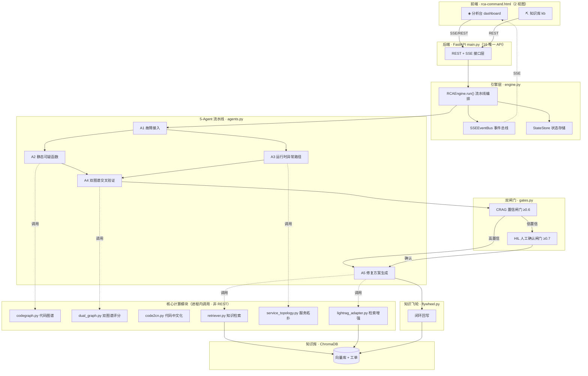
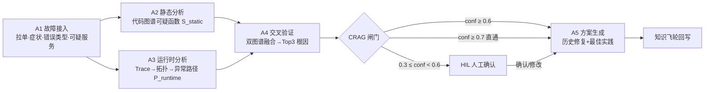
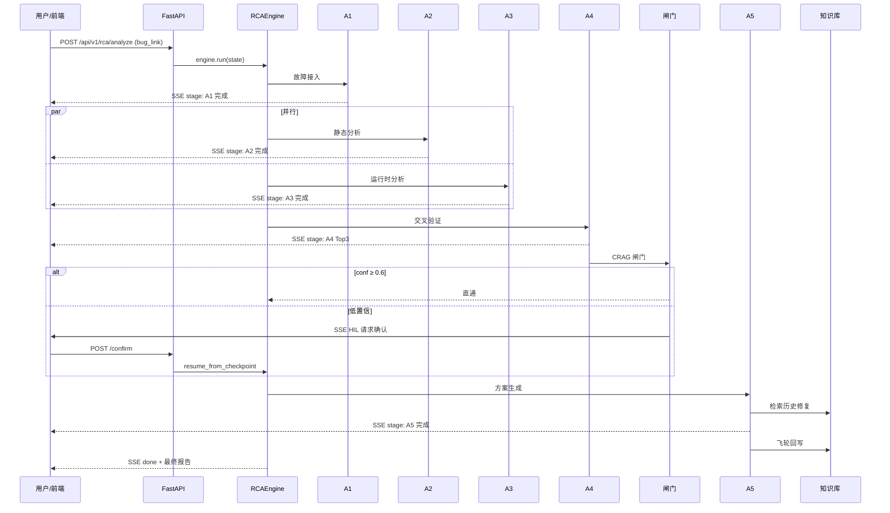
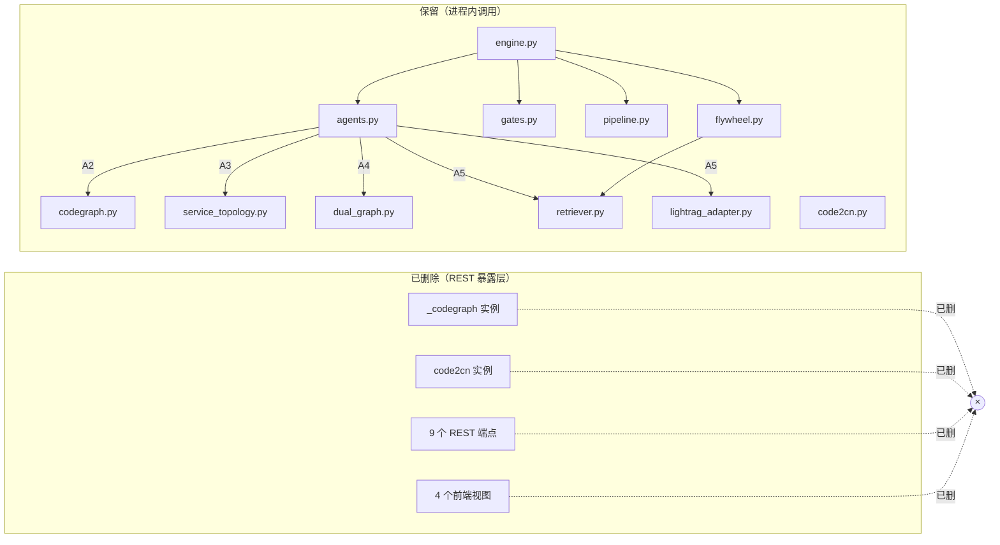

# RCA 智能根因分析系统 · 架构文档

> 版本：精简版 v2.0　|　更新日期：2026-09-19
> 本文档描述精简后的系统架构，阐明**保留的核心功能**与**已删除的模块**，作为后续开发与运维的权威参考。

---

## 1. 概述

RCA 系统是一个基于 **5-Agent 流水线**的智能根因分析平台，核心使命是：**给定一个故障单（Bug Link / 描述），自动定位根因函数并给出修复建议**。

精简决策遵循业界最佳实践（对标 Datadog Watchdog、Sentry、Amazon DevOps Guru、Backstage）：

- **核心 = 根因分析 + 知识库**
- 删除一切「可视化解耦为独立 REST 端点」的辅助视图模块
- Python 计算模块（codegraph / code2cn / lightrag）保留，由流水线**进程内直接调用**，不再暴露独立 REST

精简后系统从「分析 + 知识库 + 4 个辅助可视化视图」收敛为「**分析 + 知识库**」双核心，代码、接口、文档、测试四层一致。

---

## 2. 系统整体架构



---

## 3. 保留的核心功能

### 3.1 根因分析引擎（5-Agent 流水线）

流水线由 [engine.py](file:///workspace/rca-backend/app/engine.py) 的 `RCAEngine.run()` 编排，5 个 Agent 定义于 [agents.py](file:///workspace/rca-backend/app/agents.py)：



| Agent | 类 | 职责 | 输入 → 输出 |
|-------|-----|------|------------|
| A1 | `AgentA1` | 故障接入：拉取工单、提取症状、推断错误类型、构建查询、定位可疑服务 | BugInfo → A1Output |
| A2 | `AgentA2` | 静态分析：基于代码图谱生成静态可疑函数集 | suspect_services → S_static |
| A3 | `AgentA3` | 运行时分析：Trace → 服务拓扑 → 异常传播路径 | suspect_services → AnomalyPath |
| A4 | `AgentA4` | 双图谱交叉验证：融合静态与运行时，输出 Top3 根因 | S_static + P_runtime → Top3 |
| A5 | `AgentA5` | 修复方案生成：检索历史修复 + 最佳实践，组装解决方案 | Top3 → Solution |

**编排特性**：A2 与 A3 **并行执行**（无数据依赖），A4 汇聚两者结果，形成 `A1 → A2‖A3 → A4 → 闸门 → A5` 的拓扑。

### 3.2 双图谱交叉验证

定义于 [dual_graph.py](file:///workspace/rca-backend/app/dual_graph.py)，是 A4 的核心算法：

- **静态图谱**（A2 产出）：函数调用可达性、静态深度
- **运行时图谱**（A3 产出）：异常传播路径、运行时异常度
- **融合评分**（`compute_score`）：四维加权
  - `w1` 运行时异常（默认 0.3）
  - `w2` 指标相关性（默认 0.3）
  - `w3` 变更近因（默认 0.2）
  - `w4` 静态深度（默认 0.2）
- **交叉验证**（`cross_validate`）：静态可达 ∩ 运行时命中 → 置信度提升

### 3.3 双闸门机制

定义于 [gates.py](file:///workspace/rca-backend/app/gates.py)，阈值配置于 [config.py](file:///workspace/rca-backend/app/config.py)：

| 闸门 | 函数 | 阈值 | 作用 |
|------|------|------|------|
| CRAG | `crag_gate` | `GATE_CONFIDENCE_THRESHOLD = 0.6` | 置信度分级：≥0.6 直通；≥0.3×阈值 需复核；更低降级 |
| HIL | `hil_gate` | `HIL_CONFIDENCE_THRESHOLD = 0.7` | 低置信触发人工确认，支持 `resume` 恢复 |

人工确认后通过 [engine.py:resume_from_checkpoint](file:///workspace/rca-backend/app/engine.py#L432) 恢复流水线，无需重跑 A1–A4。

### 3.4 知识飞轮

定义于 [flywheel.py](file:///workspace/rca-backend/app/flywheel.py)（`Flywheel` 类）：A5 产出的修复方案经去重（cosine ≥ 0.95 视为重复）后**闭环回写知识库**，形成「分析 → 修复 → 沉淀 → 再分析」的飞轮。

### 3.5 知识库管理

基于 ChromaDB 向量库（[retriever.py](file:///workspace/rca-backend/app/retriever.py)），提供工单导入、检索、删除全生命周期管理，是 A5 历史修复检索与飞轮回写的数据底座。

### 3.6 实时通信与状态

- **SSE 流式推送**：[SSEEventBus](file:///workspace/rca-backend/app/engine.py#L30) 在每个 Agent 阶段实时推送进度，前端分析台订阅展示
- **状态持久化**：[StateStore](file:///workspace/rca-backend/app/engine.py#L70) 保存 RCAState，支持 HIL 检查点恢复

---

## 4. 数据流时序



---

## 5. API 接口清单（精简后 16 个唯一路径）

| 路径 | 方法 | 功能 | 类别 |
|------|------|------|------|
| `/api/health` | GET | 基础健康检查 | 健康 |
| `/api/v1/health` | GET | V3 组件级健康检查 | 健康 |
| `/api/analyze` | POST | V2 分析触发（兼容） | 根因分析 |
| `/api/analyze/{task_id}/stream` | GET | V2 SSE 流 | 根因分析 |
| `/api/analyze/{task_id}` | GET | V2 报告查询 | 根因分析 |
| `/api/v1/rca/analyze` | POST | V3 分析触发 | 根因分析 |
| `/api/v1/rca/tasks` | GET | 任务列表 | 根因分析 |
| `/api/v1/rca/{task_id}/stream` | GET | V3 SSE 流 | 根因分析 |
| `/api/v1/rca/{task_id}` | GET | V3 结果查询 | 根因分析 |
| `/api/v1/rca/{task_id}/state` | GET | 状态查询 | 根因分析 |
| `/api/v1/rca/{task_id}/confirm` | POST | HIL 人工确认 | 根因分析 |
| `/api/v1/rca/{task_id}/resume` | POST | HIL 恢复执行 | 根因分析 |
| `/api/kb/import` | POST | 知识库导入 | 知识库 |
| `/api/kb/count` | GET | 知识库计数 | 知识库 |
| `/api/kb/tickets` | GET/DELETE | 工单列表/删除 | 知识库 |
| `/api/v1/yunjie/import` | POST | 云阶工单导入 | 知识库 |

---

## 6. 已删除的模块

### 6.1 设计依据

删除遵循「**视图专用 REST 端点 + 独立可视化视图**」的辅助模块，依据：

1. **Datadog Watchdog / DevOps Guru**：核心价值在自动根因定位与告警，而非代码图谱浏览器
2. **Backstage**：开发者门户的图谱浏览应作为独立产品，不应耦合在 RCA 流水线内
3. **Sentry**：修复建议依赖知识检索，代码中文化/拓扑图属辅助能力，可由流水线内部模块提供

### 6.2 删除清单

#### 6.2.1 前端视图（rca-command.html）

| 删除视图 | 原功能 | 删除理由 |
|---------|--------|---------|
| 拓扑图视图 | 服务拓扑可视化渲染 | 拓扑计算已由 A3 进程内调用 service_topology.py 完成，视图仅展示 |
| 代码图谱视图 | 函数调用关系浏览 | codegraph.py 模块保留供 A2 调用，独立浏览视图属辅助 |
| 代码中文化视图 | 符号→中文摘要生成 | code2cn.py 模块保留供流水线调用，独立视图属辅助 |
| RAG 检索视图 | 知识库语义检索调试 | lightrag_adapter.py 保留供 A5 调用，独立调试视图属辅助 |

**保留视图**：`view-dashboard`（分析台）、`view-kb`（知识库）。

每个删除视图连带删除其：DOM 容器、导航按钮、JS 函数、CSS 样式、`init()` 事件监听（共清理 11 个失效监听器）。

#### 6.2.2 后端 REST 端点（main.py）

| 删除端点 | 原功能 | 依赖的 Python 模块 | 模块去向 |
|---------|--------|------------------|---------|
| `POST /api/v1/code2cn/generate` | 代码中文化生成 | code2cn.py | **保留**（流水线调用） |
| `GET /api/v1/code2cn/outline/{symbol}` | 代码大纲查询 | code2cn.py | **保留** |
| `GET /api/v1/codegraph/node/{symbol}` | 图谱节点查询 | codegraph.py | **保留** |
| `GET /api/v1/codegraph/callers/{symbol}` | 调用方查询 | codegraph.py | **保留** |
| `GET /api/v1/codegraph/callees/{symbol}` | 被调用方查询 | codegraph.py | **保留** |
| `GET /api/v1/codegraph/explore/{symbol}` | 图谱探索 | codegraph.py | **保留** |
| `POST /api/v1/rag/query` | RAG 语义查询 | lightrag_adapter.py | **保留** |
| `POST /api/v1/rag/insert` | RAG 文档插入 | lightrag_adapter.py | **保留** |
| `POST /api/v1/rag/insert_kg` | RAG 知识图谱插入 | lightrag_adapter.py | **保留** |

**关键设计**：删除的是「视图专用 REST 暴露层」与 `_codegraph` 实例、`code2cn` 实例、`CodeGraph`/`intent_to_mode` 导入；**Python 计算模块文件全部保留**，由 A2/A3/A4/A5 进程内直接方法调用。

> 注：`lightrag_adapter` 的 `lightrag` 实例因被 engine.py 与 flywheel.py 直接使用，**import 保留**。

#### 6.2.3 文档章节（rca-solution-summary.html）

方案文档从 14 章精简为 8 章（hero + 7 编号章），删除 6 章：

| 删除章节 | 原内容 |
|---------|--------|
| code2cn 模块说明 | 代码中文化模块详细设计 |
| codegraph 模块说明 | 代码图谱模块详细设计 |
| lightrag 模块说明 | RAG 检索模块详细设计 |
| 路线图 | 后续演进规划 |
| 创新点 | 技术创新总结 |
| 参考文献 | 业界资料引用 |

保留章节重编号为 01–07 连续序列，导航与 scroll-spy 动态联动。

#### 6.2.4 测试用例

删除 4 个测试文件中的 **REST API 测试类**（共 30 个测试方法），**保留 Python 模块单元测试**：

| 测试文件 | 删除的类 | 保留的类 |
|---------|---------|---------|
| test_code2cn.py | `TestCode2CnRestApi` | TestLLMClient / TestOutlineGeneration / TestCacheLayer 等 |
| test_codegraph_api.py | `TestCodeGraphRestApi` | `TestCodeGraphSchema` |
| test_lightrag_api.py | `TestRagRestApi` / `TestFullPipelineIntegration` | TestIntentClassification / TestIntentToMode 等 |
| test_e2e_full.py | TestCodeGraphAPI / TestCode2CnAPI / TestRAGAPI | V2/V3 端到端测试 |

---

## 7. 模块依赖关系



**核心不变量**：删除 REST 端点不影响流水线，因 A2–A5 通过 **Python 方法**直接调用 codegraph / service_topology / dual_graph / retriever / lightrag_adapter。

---

## 8. 精简前后对比

| 维度 | 精简前 | 精简后 | 变化 |
|------|--------|--------|------|
| 前端视图 | 6 | 2 | −4 |
| 后端 API 路径 | 25 | 16 | −9 |
| 方案文档章节 | 14 | 8 | −6 |
| 测试用例 | 264 | 234 | −30 |
| Python 模块文件 | 21 | 21 | 0（全保留） |
| 核心能力 | 分析+KB+4辅助视图 | 分析+KB | 聚焦核心 |

---

## 9. 回归验证结果

精简后全量回归测试：**234 passed, 0 failed**（耗时 115s）。

- 后端 import 验证：`from app.main import app` 成功
- 删除端点残留扫描：.py / .js / .html 全量 grep，零引用
- 前端 API 调用对账：12 个 fetch/api 调用全部映射到现存路由
- 前端 JS 残留扫描：无 renderTopology / cgNode / c2cnGen / ragSearch 等失效引用
- div 标签平衡：前端 279/279，文档 76/76

---

## 10. 目录结构（精简后）

```
/workspace
├── rca-command.html              # 前端（2 视图：分析台 + 知识库）
├── rca-solution-summary.html     # 方案文档（8 章节）
├── ARCHITECTURE.md              # 本架构文档
└── rca-backend/
    ├── app/
    │   ├── main.py              # FastAPI（16 API，无视图专用端点）
    │   ├── engine.py            # RCAEngine + SSEEventBus + StateStore
    │   ├── agents.py            # A1–A5 五 Agent
    │   ├── pipeline.py          # 流水线编排
    │   ├── gates.py             # CRAG + HIL 双闸门
    │   ├── dual_graph.py        # 双图谱交叉验证
    │   ├── codegraph.py         # 代码图谱（保留，进程内调用）
    │   ├── code2cn.py           # 代码中文化（保留，进程内调用）
    │   ├── lightrag_adapter.py  # RAG 检索（保留，进程内调用）
    │   ├── service_topology.py  # 服务拓扑（保留，进程内调用）
    │   ├── retriever.py         # 知识检索
    │   ├── flywheel.py          # 知识飞轮
    │   ├── models.py            # 数据模型
    │   └── config.py            # 配置（闸门阈值等）
    └── tests/                   # 234 测试用例
```

---

*本文档随系统精简同步更新，作为架构权威参考。*
