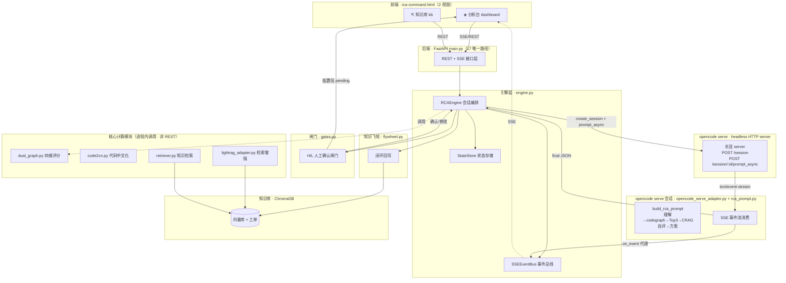
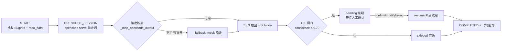
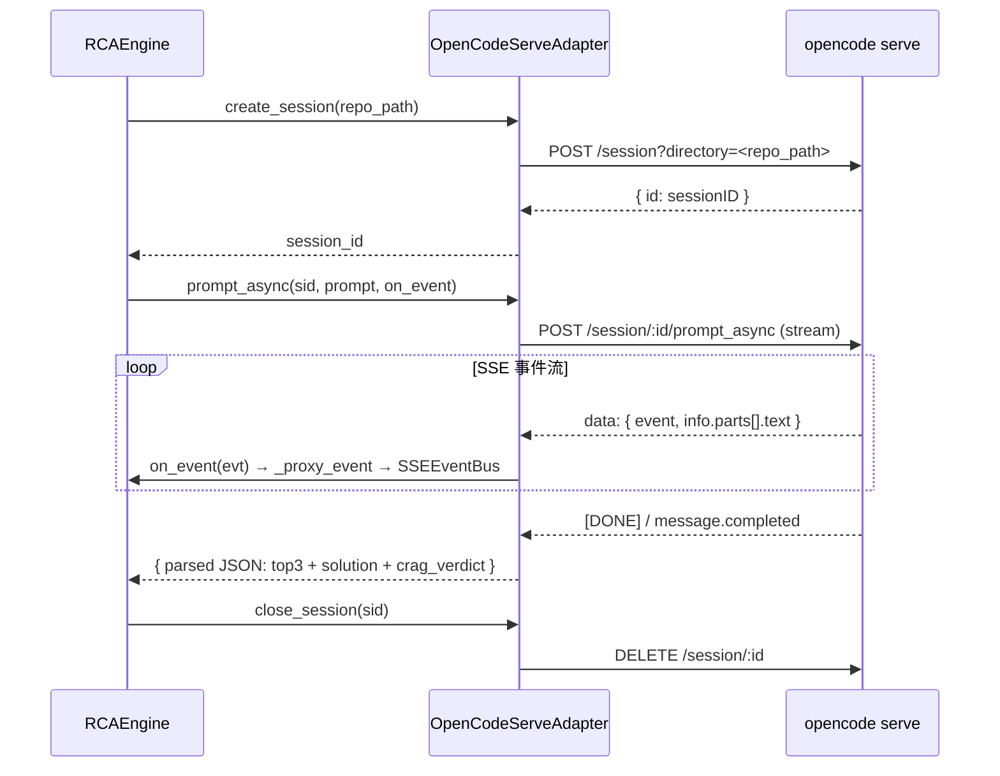
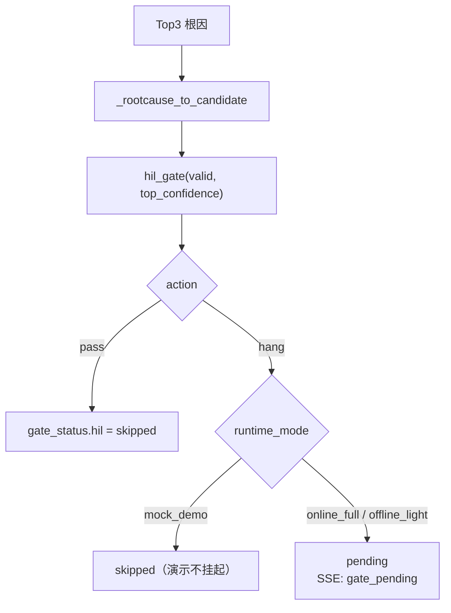
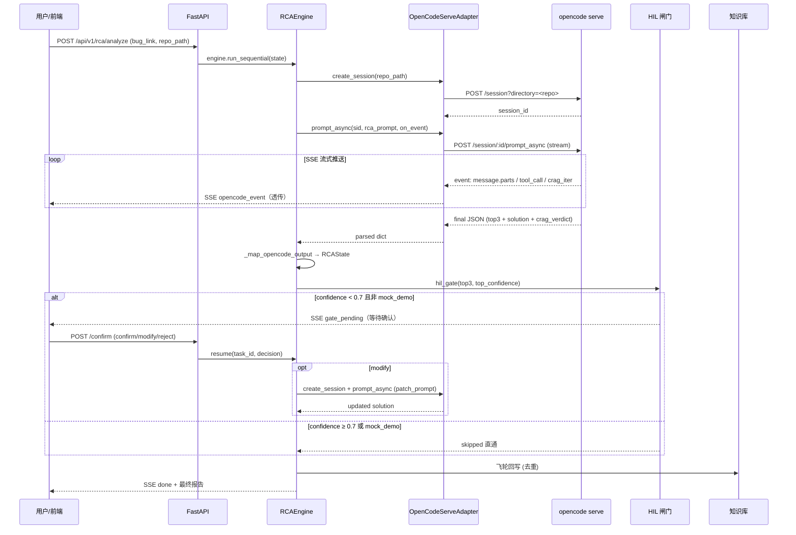
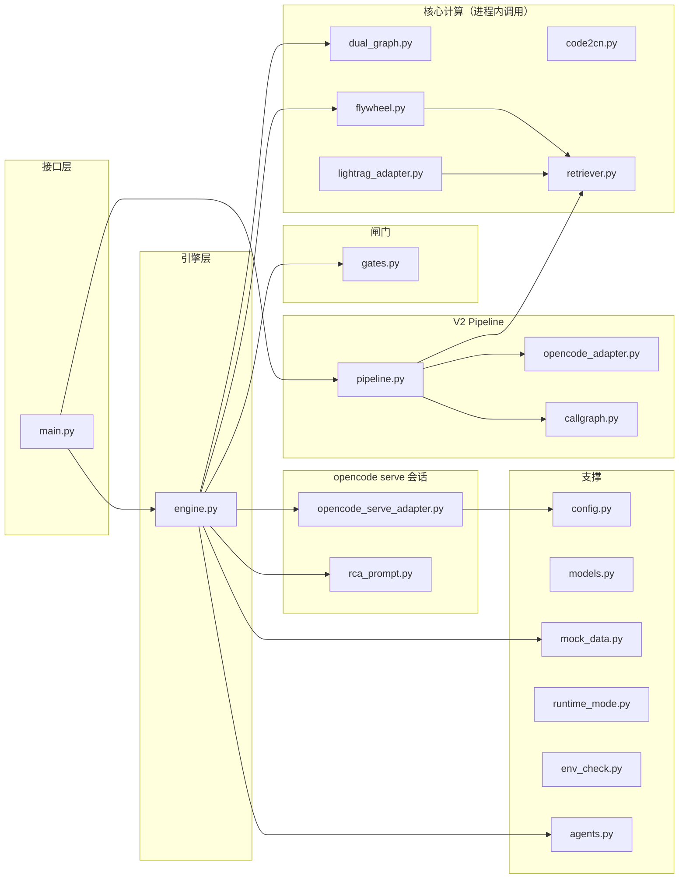

# RCA 智能根因分析系统 · 架构文档

> 版本：v5.0（opencode serve headless 架构）　|　更新日期：2026-09-20
> 本文档描述系统当前架构与核心能力，作为后续开发与运维的权威参考。

---

## 1. 概述

RCA 系统是一个基于 **opencode serve headless 会话**的智能根因分析平台，核心使命是：**给定一个故障单（Bug Link / 描述）与本地代码仓路径，自动定位根因函数并给出修复建议**。

系统聚焦两大核心能力：

- **根因分析**：`opencode serve 单会话（理解→codegraph 分析→Top-3→CRAG 自评迭代→方案生成） → HIL 人工闸门` 的端到端编排
- **知识库**：基于 ChromaDB 向量库的工单导入、检索、删除全生命周期管理

V3 根因分析由 [engine.py](file:///workspace/rca-backend/app/engine.py) 的 `RCAEngine` 统一编排，opencode serve 通信由 [opencode_serve_adapter.py](file:///workspace/rca-backend/app/opencode_serve_adapter.py) 的 `OpenCodeServeAdapter` 承担，会话 prompt 模板集中于 [rca_prompt.py](file:///workspace/rca-backend/app/rca_prompt.py)。Python 层保留 HIL 人工闸门、SSE 事件代理、RCAState 状态持久化与断点续跑；CRAG 自评估逻辑嵌入 prompt，由 LLM 在会话内自行迭代完成。

---

## 2. 系统整体架构



---

## 3. 根因分析引擎（opencode serve 会话编排）

流水线由 [engine.py](file:///workspace/rca-backend/app/engine.py) 的 `RCAEngine.run_sequential()` 编排，拓扑为 **START → OPENCODE_SESSION → HIL → END**：



| 阶段 | 实现方法 | 职责 | 输入 → 输出 |
|------|---------|------|------------|
| OPENCODE_SESSION | [\_apply_opencode_session](file:///workspace/rca-backend/app/engine.py#L204) | 调用 opencode serve 单会话完成端到端分析：理解症状→codegraph 分析→Top-3 定位→CRAG 自评迭代→方案生成 | BugInfo + repo_path → Top3 + Solution |
| HIL | [\_apply_hil](file:///workspace/rca-backend/app/engine.py#L245) | Python 后置闸门：Top-1 置信度 < 0.7 挂起等待人工确认 | Top3 → pending/skipped |
| PATCH_SESSION | [\_apply_patch_session](file:///workspace/rca-backend/app/engine.py#L269) | HIL modify 后的轻量补丁会话：基于确认 Top3 重生成 patch/steps | modified_top3 → Solution |
| 降级 | [\_fallback_mock](file:///workspace/rca-backend/app/engine.py#L436) | serve 不可用 / mock_demo 模式时的降级路径：SAMPLE_TICKETS 派生 Top3 + Solution | → Top3 + Solution |

### 3.1 opencode serve 会话生命周期

[OpenCodeServeAdapter](file:///workspace/rca-backend/app/opencode_serve_adapter.py#L33) 封装 opencode serve 长驻 server 的会话生命周期：



**会话参数**：

| 参数 | 来源 | 说明 |
|------|------|------|
| `directory` / `x-opencode-directory` | `AnalyzeRequest.repo_path` | 用户指定本地代码仓路径，opencode 在此仓内分析 |
| `prompt` | [build_rca_prompt](file:///workspace/rca-backend/app/rca_prompt.py#L61) | 主会话 prompt，含 CRAG 自评指令 + JSON schema |
| `stream` | `True` | 启用 `text/event-stream` 流式输出 |

### 3.2 CRAG 自评估（嵌入 prompt）

CRAG 自评估逻辑嵌入 [rca_prompt.py:build_rca_prompt](file:///workspace/rca-backend/app/rca_prompt.py#L61)，由 LLM 在会话内自行迭代，Python 层不做 fallback 补强：

| 判定 | 触发条件 | LLM 行为 |
|------|---------|---------|
| `relevant` | 四维证据齐全且均分 ≥ 0.6 | 直接输出最终结果 |
| `ambiguous` | 部分维度缺失或偏弱（均分 0.3~0.6） | 会话内调用 codegraph 工具补强弱维度，重评 |
| `irrelevant` | 证据不足或方向错误（均分 < 0.3） | 全维度补强，重评 |

迭代上限由 `config.gate.max_rewrite_rounds`（默认 3）控制，写入 prompt 指导 LLM。最终 verdict 写入 JSON 的 `crag_verdict` 字段，由 [\_map_opencode_output](file:///workspace/rca-backend/app/engine.py#L354) 映射到 `RCAState.gate_status.crag`。

### 3.3 输出映射

[\_map_opencode_output](file:///workspace/rca-backend/app/engine.py#L354) 将 opencode 会话的严格 JSON 输出映射到 [RCAState](file:///workspace/rca-backend/app/models.py#L344)：

| JSON 字段 | 映射目标 | 说明 |
|-----------|---------|------|
| `symptoms` | `state.symptoms` | 症状列表 |
| `error_type` | `state.error_type` | 错误类型 |
| `query` | `state.query` | 检索查询语句 |
| `suspect_services` | `state.suspect_services` | 嫌疑微服务 |
| `crag_verdict` | `state.gate_status.crag` | CRAG 自评结果 |
| `top3[]` | `state.top3` | Top-3 根因（含四维证据） |
| `solution` | `state.solution` | 修复方案 |

若 opencode 输出无效（空 dict / 非字典），自动降级到 [\_fallback_mock](file:///workspace/rca-backend/app/engine.py#L436)。

### 3.4 降级策略

当满足以下任一条件时，引擎降级到 mock 路径：

| 条件 | 场景 |
|------|------|
| `runtime_mode == "mock_demo"` | 演示模式，不调用真实 serve |
| `serve is None` | 未注入适配器 |
| `serve.available == False` | serve 健康检查失败 |
| `repo_path` 为空 | 未提供本地代码仓路径 |
| 会话抛出 `OpenCodeServeError` | 创建/消费/关闭会话失败 |
| 会话抛出未知异常 | 网络超时等 |

降级路径 [\_fallback_mock](file:///workspace/rca-backend/app/engine.py#L436) 基于 `SAMPLE_TICKETS` 派生 Top3（置信度递减 0.65→0.55→0.45）与 [\_mock_solution](file:///workspace/rca-backend/app/engine.py#L471)，保证 mock_demo 模式可用。降级时 `state.degraded = True`。

---

## 4. HIL 人工确认闸门

定义于 [gates.py](file:///workspace/rca-backend/app/gates.py)，阈值配置于 [config.py:GateConfig](file:///workspace/rca-backend/app/config.py#L63)：

| 闸门 | 函数 | 阈值 | 作用 |
|------|------|------|------|
| HIL | [hil_gate](file:///workspace/rca-backend/app/gates.py#L69) | `HIL_CONFIDENCE_THRESHOLD = 0.7` | Top-1 置信度 < 0.7 挂起人工确认，支持 `resume` 恢复 |

### 4.1 HIL 判定逻辑

[engine._apply_hil](file:///workspace/rca-backend/app/engine.py#L245) 在 OPENCODE_SESSION 完成后执行：



`mock_demo` 模式下即使触发 `hang` 也直接 `skipped`（演示不阻塞）；其他模式触发 `pending`，通过 SSEEventBus 推送 `gate_pending` 事件，前端展示确认面板。

### 4.2 断点续跑

人工确认后通过 [engine.resume](file:///workspace/rca-backend/app/engine.py#L293) 恢复执行，无需重跑 opencode 会话：

| 决策动作 | 处理 |
|---------|------|
| `confirm` | 采纳 Top3 原样，`hil = confirmed` |
| `modify` | 应用 `modified_top3`，`hil = modified`，触发 [\_apply_patch_session](file:///workspace/rca-backend/app/engine.py#L269) 重生成方案 |
| `reject` | `hil = rejected`，`stage = REJECTED`，终止 |

resume 后重新进入 `run_sequential`，因 `stage.index >= 4` 跳过 OPENCODE_SESSION，直接到 COMPLETED + 飞轮回写。

---

## 5. 知识库与飞轮

### 5.1 知识库管理

基于 ChromaDB 向量库（[retriever.py](file:///workspace/rca-backend/app/retriever.py)），提供工单导入、检索、删除全生命周期管理，是 LightRAG 检索增强与飞轮回写的数据底座。

### 5.2 知识飞轮

定义于 [flywheel.py](file:///workspace/rca-backend/app/flywheel.py)（`Flywheel` 类）：会话产出的修复方案经去重（cosine ≥ `GATE_DEDUP_COSINE_THRESHOLD`，默认 0.95 视为重复）后**闭环回写知识库**，形成「分析 → 修复 → 沉淀 → 再分析」的飞轮。回写在 COMPLETED 阶段自动触发（[engine.py:172](file:///workspace/rca-backend/app/engine.py#L172)），去重命中则推送 `flywheel_skipped` 事件。

---

## 6. 可观测性

全链路采用结构化日志，消除静默异常吞噬。所有 `except` 分支均带上下文 `logger.warning`：

| 文件 | 覆盖场景 |
|------|---------|
| [engine.py](file:///workspace/rca-backend/app/engine.py) | 会话异常降级、HIL 判定、飞轮回写、patch 会话失败 |
| [opencode_serve_adapter.py](file:///workspace/rca-backend/app/opencode_serve_adapter.py) | serve 不可用、会话创建/消费/关闭异常、on_event 回调异常 |
| [flywheel.py](file:///workspace/rca-backend/app/flywheel.py) | 回写同步失败 |
| [lightrag_adapter.py](file:///workspace/rca-backend/app/lightrag_adapter.py) | `ainsert` / `ainsert_custom_kg` / `aquery` 失败 |
| [main.py](file:///workspace/rca-backend/app/main.py) | API 层异常 |

---

## 7. 实时通信与状态

- **SSE 流式推送**：[SSEEventBus](file:///workspace/rca-backend/app/engine.py#L36) 在每个阶段实时推送进度（`stage_start` / `stage_complete` / `opencode_event` / `gate_pending` / `gate_resolved` / `final` / `error`），Redis list 持久化 + 内存回退，前端分析台订阅展示
- **opencode 事件代理**：[\_proxy_event](file:///workspace/rca-backend/app/engine.py#L343) 将 opencode serve 的 SSE 事件透传到 SSEEventBus，前端可实时看到 codegraph 查询、CRAG 迭代等会话内进度
- **状态持久化**：[StateStore](file:///workspace/rca-backend/app/engine.py#L76) 保存 [RCAState](file:///workspace/rca-backend/app/models.py#L344)，支持 HIL 检查点恢复（key = `rca:state:{task_id}`，TTL 24h）

[RCAState](file:///workspace/rca-backend/app/models.py#L344) 携带 16 个字段，关键流转字段：

| 字段 | 类型 | 说明 |
|------|------|------|
| `top3` | `list[RootCause]` | 会话输出的 Top-3 根因（含四维证据） |
| `gate_status` | `GateStatus` | 闸门状态（crag / hil） |
| `solution` | `Solution` | 修复方案（diffs/steps/test_cases） |
| `P_runtime` | `AnomalyPath` | 运行时异常路径（从 Top3 的 located_function 派生） |
| `degraded` | `bool` | 是否降级到 mock 路径 |
| `runtime_mode` | `Literal[...]` | 运行模式：`online_full` / `offline_light` / `mock_demo` |

---

## 8. 数据流时序



---

## 9. API 接口清单（17 唯一路径）

| 路径 | 方法 | 功能 | 类别 |
|------|------|------|------|
| `/api/health` | GET | 基础健康检查 | 健康 |
| `/api/v1/health` | GET | V3 组件级健康检查 | 健康 |
| `/api/analyze` | POST | V2 分析触发（兼容） | 根因分析 |
| `/api/analyze/{task_id}/stream` | GET | V2 SSE 流 | 根因分析 |
| `/api/analyze/{task_id}` | GET | V2 报告查询 | 根因分析 |
| `/api/v1/rca/analyze` | POST | V3 分析触发（含 repo_path） | 根因分析 |
| `/api/v1/rca/tasks` | GET | 任务列表 | 根因分析 |
| `/api/v1/rca/{task_id}/stream` | GET | V3 SSE 流 | 根因分析 |
| `/api/v1/rca/{task_id}` | GET | V3 结果查询 | 根因分析 |
| `/api/v1/rca/{task_id}/state` | GET | 状态查询 | 根因分析 |
| `/api/v1/rca/{task_id}/confirm` | POST | HIL 人工确认 | 根因分析 |
| `/api/v1/rca/{task_id}/resume` | POST | HIL 恢复执行 | 根因分析 |
| `/api/kb/import` | POST | 知识库导入 | 知识库 |
| `/api/kb/count` | GET | 知识库计数 | 知识库 |
| `/api/kb/tickets` | GET | 工单列表 | 知识库 |
| `/api/kb/tickets` | DELETE | 工单删除 | 知识库 |
| `/api/v1/yunjie/import` | POST | 云捷工单导入 | 知识库 |

> `/api/kb/tickets` 同一路径注册 GET 与 DELETE 两个方法，故路由装饰器共 18 个、唯一路径 17 个。

---

## 10. 模块依赖关系



**核心调用链**：`RCAEngine._apply_opencode_session` → `OpenCodeServeAdapter.create_session + prompt_async`（SSE 流消费 + 事件代理）→ `_map_opencode_output` → `_apply_hil`（hil_gate）→ COMPLETED + `flywheel.writeback_sync`。

---

## 11. 目录结构

```
/workspace
├── rca-command.html              # 前端（2 视图：分析台 + 知识库）
├── rca-solution-summary.html     # 方案文档
├── ARCHITECTURE.md              # 本架构文档
└── rca-backend/
    ├── app/                      # 20 个 Python 模块
    │   ├── main.py              # FastAPI（17 唯一路径）
    │   ├── engine.py            # RCAEngine + SSEEventBus + StateStore
    │   ├── opencode_serve_adapter.py  # opencode serve HTTP 适配器（V3 会话）
    │   ├── rca_prompt.py        # CRAG 自评 prompt 模板
    │   ├── pipeline.py          # V2 Pipeline（6 步：拉单→克隆→分析→调用图→检索→综合）
    │   ├── gates.py             # HIL 闸门 + CRAG 评估工具
    │   ├── dual_graph.py        # 四维融合评分 + cross_validate
    │   ├── code2cn.py           # 代码中文化
    │   ├── lightrag_adapter.py  # RAG 检索
    │   ├── retriever.py         # 知识检索（ChromaDB）
    │   ├── flywheel.py          # 知识飞轮
    │   ├── opencode_adapter.py  # OpenCode 代码分析适配器（V2 子进程模式）
    │   ├── callgraph.py         # 调用图辅助
    │   ├── runtime_mode.py      # 降级模式矩阵
    │   ├── models.py            # 数据模型（RCAState 16 字段 + AnalyzeRequest.repo_path）
    │   ├── config.py            # 配置（GateConfig + OpenCodeServeConfig + ScoreWeights）
    │   ├── mock_data.py         # Mock 样本数据
    │   ├── env_check.py         # 环境检查
    │   └── __init__.py          # 包初始化
    └── tests/                   # 212 测试用例（13 测试文件）
```

---

## 12. 测试体系

全量回归：**212 passed, 0 failed**（3 个第三方 chromadb DeprecationWarning）。

| 测试文件 | 用例数 | 覆盖范围 |
|---------|--------|---------|
| [test_e2e_full.py](file:///workspace/rca-backend/tests/test_e2e_full.py) | 28 | V2/V3 全端点端到端 |
| [test_engine.py](file:///workspace/rca-backend/tests/test_engine.py) | 27 | RCAEngine 会话编排 + 降级 + 断点续跑 |
| [test_gates_flywheel.py](file:///workspace/rca-backend/tests/test_gates_flywheel.py) | 25 | HIL 闸门 + 飞轮 |
| [test_dual_graph.py](file:///workspace/rca-backend/tests/test_dual_graph.py) | 24 | 四维评分 + 交叉验证 |
| [test_lightrag_api.py](file:///workspace/rca-backend/tests/test_lightrag_api.py) | 18 | RAG 适配器 |
| [test_deploy.py](file:///workspace/rca-backend/tests/test_deploy.py) | 18 | 部署验证 |
| [test_opencode_serve_adapter.py](file:///workspace/rca-backend/tests/test_opencode_serve_adapter.py) | 13 | serve 适配器（JSON 提取 / 健康降级 / SSE 消费） |
| [test_degradation.py](file:///workspace/rca-backend/tests/test_degradation.py) | 12 | 降级模式 |
| [test_integration.py](file:///workspace/rca-backend/tests/test_integration.py) | 11 | 集成测试 |
| [test_code2cn.py](file:///workspace/rca-backend/tests/test_code2cn.py) | 11 | 代码中文化 |
| [test_pipeline_synthesize.py](file:///workspace/rca-backend/tests/test_pipeline_synthesize.py) | 10 | V2 Pipeline 综合 |
| [test_env_validation.py](file:///workspace/rca-backend/tests/test_env_validation.py) | 8 | 环境校验 |
| [test_e2e.py](file:///workspace/rca-backend/tests/test_e2e.py) | 7 | E2E 冒烟 |

---

## 13. 配置参数

### 13.1 OpenCodeServeConfig（[config.py:126](file:///workspace/rca-backend/app/config.py#L126)）

| 字段 | 默认值 | 环境变量 | 说明 |
|------|--------|---------|------|
| `base_url` | `http://localhost:4096` | `OPENCODE_SERVE_URL` | opencode serve 地址 |
| `auth_token` | `""` | `OPENCODE_SERVE_TOKEN` | Bearer 认证令牌 |
| `timeout` | `300` | `OPENCODE_SERVE_TIMEOUT` | HTTP 超时（秒） |
| `poll_interval` | `0.5` | `OPENCODE_SERVE_POLL_INTERVAL` | SSE 轮询间隔（秒） |

### 13.2 GateConfig（[config.py:63](file:///workspace/rca-backend/app/config.py#L63)）

| 字段 | 默认值 | 环境变量 | 说明 |
|------|--------|---------|------|
| `confidence_threshold` | 0.6 | `GATE_CONFIDENCE_THRESHOLD` | CRAG relevant 阈值（prompt 内引用） |
| `hil_confidence_threshold` | 0.7 | `HIL_CONFIDENCE_THRESHOLD` | HIL 挂起阈值 |
| `max_rewrite_rounds` | 3 | `GATE_MAX_REWRITE_ROUNDS` | CRAG 自评迭代上限（写入 prompt） |
| `max_supplement_rounds` | 2 | `GATE_MAX_SUPPLEMENT_ROUNDS` | 补充轮次上限 |
| `dedup_cosine_threshold` | 0.95 | `GATE_DEDUP_COSINE_THRESHOLD` | 飞轮去重相似度阈值 |

### 13.3 ScoreWeights（[config.py:43](file:///workspace/rca-backend/app/config.py#L43)）

| 权重 | 维度 | 默认值 | 环境变量 |
|------|------|--------|---------|
| `w1` | static_depth | 0.3 | `SCORE_W1` |
| `w2` | runtime_anomaly | 0.3 | `SCORE_W2` |
| `w3` | metric_corr | 0.2 | `SCORE_W3` |
| `w4` | change_recency | 0.2 | `SCORE_W4` |

> 四维权重作为 prompt 内 codegraph 分析与 CRAG 自评的证据维度参考；`dual_graph.compute_score` 在进程内调用时使用归一化权重。

---

*本文档随系统演进同步更新，作为架构权威参考。*
